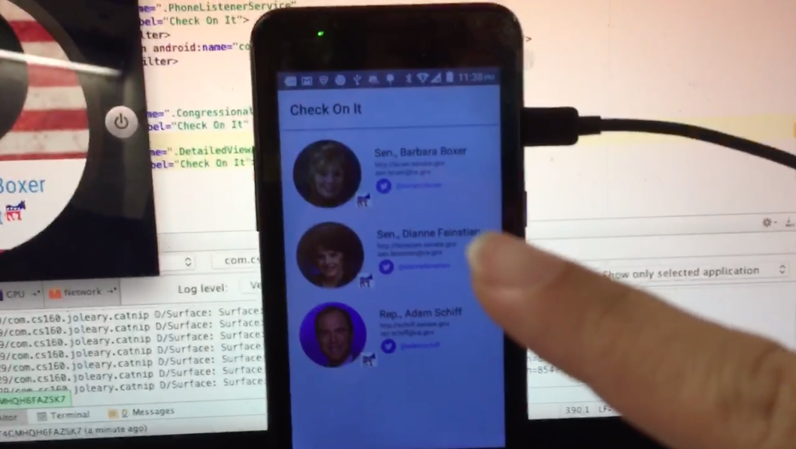
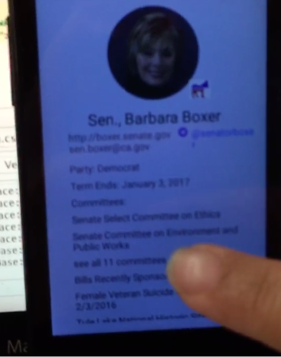
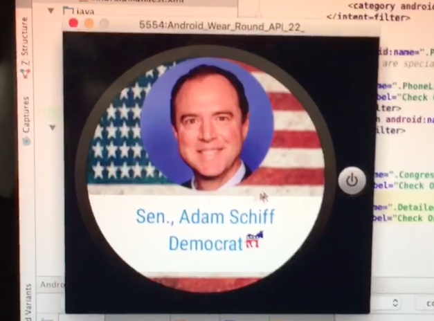
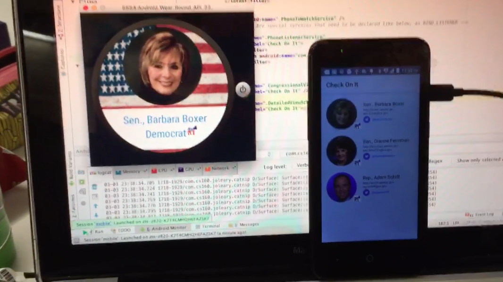

# PROG 02: Represent!

Briefly describe your app here.

## Authors

Corrina Calanoc ([corrina.calanoc@berkeley.edu](mailto:corrina.calanoc@berkeley.edu))

## Demo Video

See [your demo video title here] (https://drive.google.com/file/d/0BzIDwH44jphTUFo1NUhveUI3bVE/view?usp=sharing (Links to an external site.))

## Screenshots

 
 
 
 
 
 

## Acknowledgments

* Shout out to stack overflow always providing me with code for fragments & sensors (even tho i wasn't able to get the sensor to work before the deadline...)
* Shout out to the GSIs for holding office hours and emulator parties even tho my emulators never ended up working together :(
* Shout out to T-Mobile for providing me with an android phone on the quickness even tho I had to sign up for a plan to get the phone for cheaper since an unlocked phone with no plan is hella expensive
